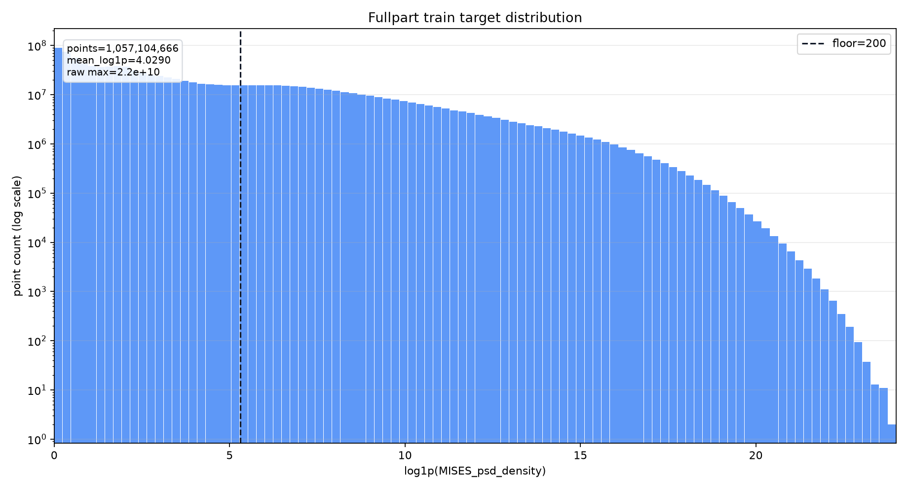
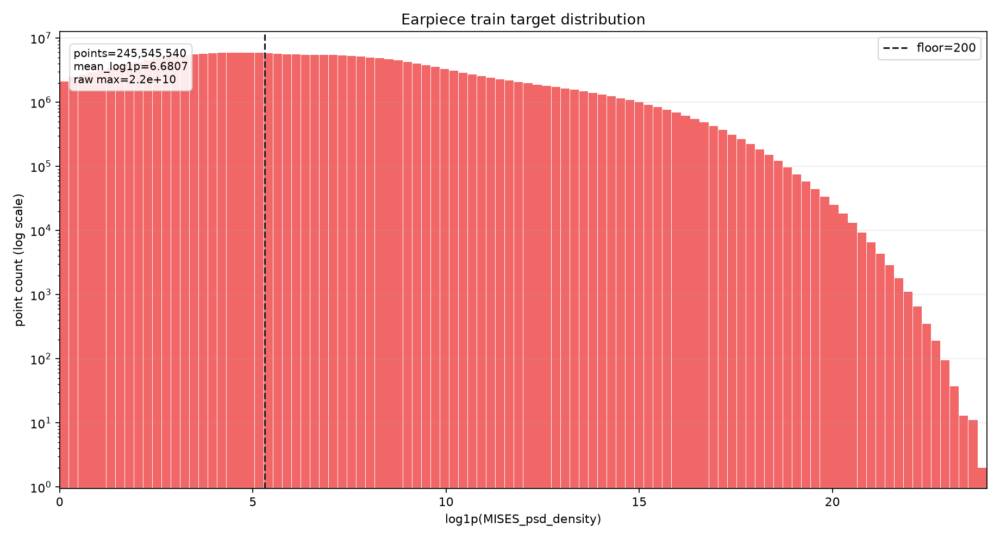
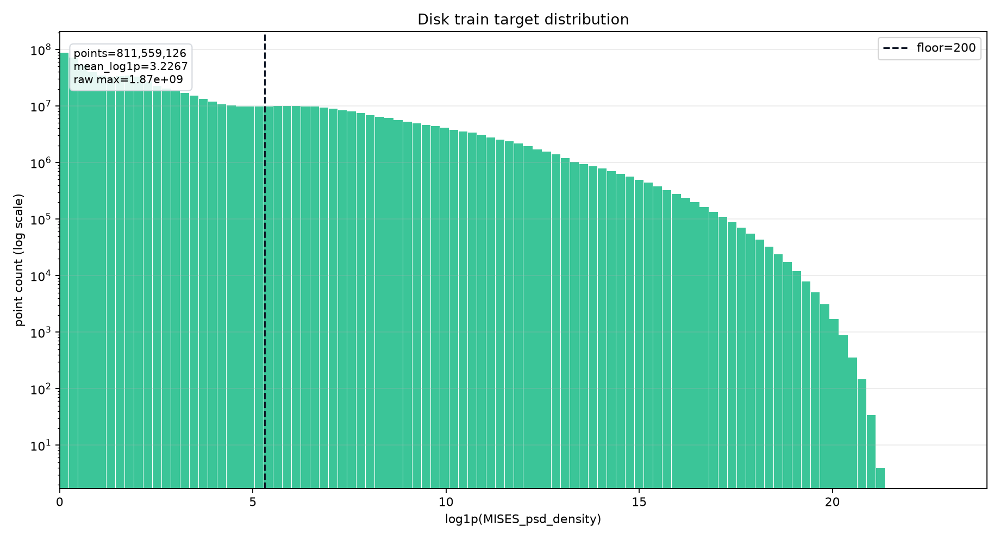

# Fullpart / 耳片 / 圆盘阈值数据分析

> 更新时间：2026-06-27  
> 关联模型：`node_mlp_v6_fullpart_fusion_low_rank_80g_fast_eval_continue32_remove_inner_disk`  
> 关联实验：`node_mlp_v6_fullpart_fusion_low_rank_80g_fast_eval_continue32_remove_inner_disk_floor200`  
> 统计输出目录：`node/outputs/disk_region_threshold_stats_remove_inner_20260627`

## 分析目的

`remove_inner_disk` 模型排除了圆盘内侧到板孔外缘之间的节点后，圆盘区域仍然包含大量低应力或近背景点。这些点在原始 `MISES_psd_density` 总量中占比很低，但在 `log1p(target)` 训练空间里占据明显权重，可能影响模型在背景、低响应和高响应峰值之间的折中。

本次分析目标：

1. 统计圆盘区域低 target 点的规模和贡献。
2. 判断这些背景点是否只是无意义噪声。
3. 为阈值实验提供依据，当前先试验 `<200 -> 200` 的固定值替换策略。

## 数据口径

统计对象为当前 `remove_inner_disk` 数据口径下的圆盘区域点：

- 已启用：`exclude_inner_disk_to_plate_hole_outer_edge: true`
- 区域：圆盘区域，不含已排除的 inner disk / disk center 区域
- target：原始 `MISES_psd_density`
- log target：`log1p(MISES_psd_density)`
- split：train / val / test 全量圆盘点

原始统计文件：

| 文件 | 说明 |
|---|---|
| `disk_region_threshold_stats.json` | 完整 JSON 统计结果 |
| `threshold_candidates_by_split.csv` | 各 split、各候选阈值下的低值占比和替换后均值 |
| `target_bands_by_split.csv` | target 分桶统计 |

## 全量圆盘点概览

train / val / test 三个 split 都扫了全量圆盘点：

| split | 圆盘点数 | mean | mean log1p |
|---|---:|---:|---:|
| train | 811,559,126 | 81,392 | 3.2267 |
| val | 100,641,358 | 86,507 | 3.3763 |
| test | 103,518,482 | 72,599 | 3.1808 |

三个 split 的圆盘区域分布基本一致：mean 处在 `7.3e4-8.7e4`，mean log1p 处在 `3.18-3.38`。说明验证集和测试集没有明显偏离训练集，低值背景不是某一个 split 的偶然现象。

## 候选阈值统计

以下为 train 口径下的关键候选阈值：

| 阈值 | 小于阈值点占比 | 小于阈值 target 总量占比 | 小于阈值 log 贡献 |
|---:|---:|---:|---:|
| 10 | 55.60% | 0.0016% | 16.32% |
| 100 | 73.19% | 0.0088% | 34.49% |
| 1,000 | 84.77% | 0.0643% | 55.17% |
| 10,000 | 93.05% | 0.4188% | 75.54% |
| 100,000 | 97.40% | 2.2548% | 89.33% |
| 1,000,000 | 99.24% | 9.4210% | 96.42% |

核心现象：

- 圆盘区域低 target 点数量极多。以 train 为例，`<100` 已占 `73.19%`，`<1,000` 占 `84.77%`。
- 这些点对原始 target 总量贡献极低。`<1,000` 的点只贡献 `0.0643%` 原始 target 总量。
- 但在 `log1p` 空间里贡献很高。`<1,000` 已贡献 `55.17%` 的 log 总量，`<10,000` 贡献 `75.54%`。

这说明低值背景不是原始能量主导项，但会显著影响以 `log1p` 为训练目标的模型。

## 背景区域是否是无意义噪声

结论：不能简单视为无意义噪声。

原因有三点：

1. 分布跨 split 稳定。train / val / test 的圆盘点均值和 log 均值接近，低值背景是数据结构的一部分，而不是某个 split 的脏数据。
2. 低值点数量极大，覆盖了大量几何、频率和 PSD 组合。它们给模型提供“哪里不应该产生假峰值”的负样本信号。
3. 在 log 空间中低值点贡献高，如果完全删除或置零，容易改变训练目标的标定方式，可能导致背景误峰、低值区域过预测或峰值排序异常。

更准确的判断是：这些点不是无意义噪声，但不应该让它们主导模型对高响应点的容量分配。

## 对模型训练的影响

当前模型主要在 `log1p(target)` 空间训练，因此圆盘背景点会产生以下影响：

1. **样本数量主导**  
   圆盘低值点占比非常高，模型每个 epoch 会反复看到大量背景点。即使单点 loss 不大，累计梯度仍可能显著。

2. **log 空间权重大**  
   原始 target 中 `<1,000` 几乎不贡献总量，但在 log 空间贡献超过一半。这会让训练目标更关注“低值背景是否拟合得很细”，而不是只关注高响应峰值。

3. **relative / within25 指标敏感**  
   对接近 0 或非常小的 target，relative error 极易放大。低值点太多时，模型会倾向于压低预测，减少低值区域过预测风险，但这可能牺牲峰值点。

4. **对耳片也可能有间接影响**  
   fullpart 模型共享一个容量和一个标定空间。圆盘背景点太多时，模型的整体输出尺度和低值惩罚会影响耳片峰值的预测。当前 `<200 -> 200` 实验中，earpiece top1 within25 早期明显提升，说明这个假设有一定依据。

## 为什么先选择阈值 200

`200` 是一个相对保守的阈值：

- 它高于极低背景区间，可以削弱接近 0 target 对 relative / log loss 的极端影响。
- 它远低于 `1,000`、`10,000`，不会把大量中低响应点强行抬高到过大的固定值。
- 对原始 target 总量影响应很小，但会明显改变极低值点在 log 空间的下界。

## 训练集 fullpart / 耳片 / 圆盘对比

由于当前 floor200 实验的 target floor 是全局生效，而不是只作用于圆盘区域，因此补充统计当前训练集 train split 的 fullpart、耳片和圆盘三类原始 target 分布。

统计输出目录：

`node/outputs/train_region_threshold_stats_remove_inner_20260627`

输出文件：

| 文件 | 说明 |
|---|---|
| `region_summary_train.csv` | train split 三个区域的点数、均值、log 均值 |
| `threshold_candidates_train_by_region.csv` | train split 三个区域在各阈值下的低值占比 |
| `target_bands_train_by_region.csv` | train split 三个区域的 target 分桶 |
| `train_region_threshold_stats.json` | 完整 JSON 统计结果 |
| `train_log1p_hist_100bins_by_region.csv` | 100-bin `log1p(target)` 直方图数据 |

区域总览：

| 区域 | 点数 | 占 fullpart | mean | mean log1p |
|---|---:|---:|---:|---:|
| fullpart | 1,057,104,666 | 100.00% | 359,920 | 4.0290 |
| 耳片 | 245,545,540 | 23.23% | 1,280,489 | 6.6807 |
| 圆盘 | 811,559,126 | 76.77% | 81,392 | 3.2267 |

关键阈值 `<200`：

| 区域 | `<200` 点占比 | `<200` target 总量占比 | `<200` log 贡献 |
|---|---:|---:|---:|
| fullpart | 68.42% | 0.0038% | 31.75% |
| 耳片 | 41.25% | 0.0015% | 18.92% |
| 圆盘 | 76.64% | 0.0149% | 39.79% |

多阈值对比：

| 区域 | `<100` 点占比 | `<200` 点占比 | `<1,000` 点占比 | `<10,000` 点占比 |
|---|---:|---:|---:|---:|
| fullpart | 64.16% | 68.42% | 78.20% | 89.01% |
| 耳片 | 34.33% | 41.25% | 56.48% | 75.65% |
| 圆盘 | 73.19% | 76.64% | 84.77% | 93.05% |

这组结果说明：

- floor200 并不是只影响圆盘。耳片区域也有 `41.25%` 训练点低于 200，会被全局 floor 抬到 200。
- 圆盘受影响更大，`76.64%` 训练点低于 200，是 fullpart 低值点的主要来源。
- 耳片的原始 mean 和 mean log1p 都显著高于圆盘，说明耳片整体响应更强；但耳片仍存在大量低响应点，不能把耳片简单看成纯高响应区域。
- `<200` 的原始 target 总量占比极低，但 log 贡献不低，尤其 fullpart 为 `31.75%`、圆盘为 `39.79%`。这解释了为什么 floor200 会改变训练动态。

## 训练集分布直方图

以下三张图均使用训练集原始 target，横轴为 `log1p(MISES_psd_density)`，共 100 个 bin，纵轴为点数的 log scale。虚线为 `target=200` 对应的 `log1p(200)`。







图上可以看到：

- fullpart 分布主要由圆盘低值点塑形，但右侧高响应长尾主要来自耳片。
- 圆盘在 `log1p(target)` 低值段有非常大的点数密度，`target=200` 左侧区域占比很高。
- 耳片分布比圆盘整体右移，长尾更强，但 `target=200` 左侧仍有大量点，这解释了为什么全局 floor200 会同时影响耳片指标。

当前实验设置：

```yaml
target:
  floor_below: 200.0
  floor_value: 200.0
```

含义：训练、验证、测试准备样本时，所有 target 中 `<200` 的值都会替换成 `200`，再计算 `log1p` 和后续指标。

关联配置：

`node/configs/node_mlp_v6_fullpart_fusion_low_rank_80g_fast_eval_continue32_remove_inner_disk_floor200.yaml`

关联输出：

`node/outputs/node_mlp_v6_fullpart_fusion_low_rank_80g_fast_eval_continue32_remove_inner_disk_floor200`

## 当前 floor200 实验早期观察

截至 epoch 8 的验证结果，floor200 实验已经出现明显改善趋势：

| epoch | selection score | fullpart within25 | disk within25 | earpiece top1 within25 | earpiece top5 within25 |
|---:|---:|---:|---:|---:|---:|
| 2 | 0.4023 | 72.23% | 78.85% | 83.34% | 82.12% |
| 4 | 0.3390 | 76.40% | 82.92% | 89.58% | 87.15% |
| 6 | 0.3104 | 78.19% | 84.50% | 91.98% | 89.28% |
| 8 | 0.2922 | 79.31% | 85.41% | 93.27% | 90.52% |

早期现象：

- selection score 持续下降，说明综合指标变好。
- disk within25 从 `78.85%` 提升到 `85.41%`。
- earpiece top1 within25 从 `83.34%` 提升到 `93.27%`，涨幅明显。
- earpiece region overall 仍弱，epoch 8 为 `58.26%` within25，说明 peak/top-k 改善不等于整个耳片区域都解决。

需要注意：这些指标是在 floor200 口径下计算的，低于 200 的 target 已经被替换成 200，因此不能与原始 target 口径完全直接横比。

## 建议

当前建议保留 floor200 实验继续跑完，重点观察：

1. epoch 10 / 12 / 14 后，earpiece top1 / top5 是否继续提升或开始回落。
2. disk within25 是否稳定在 85% 以上。
3. earpiece region overall 是否能从 58% 继续提升，否则说明 floor 主要改善 peak，不足以解决耳片中响应区域。
4. final test 中 fullpart、disk、earpiece region、earpiece top-k 的一致性。

如果 floor200 稳定优于原模型，下一步可以做两个更细实验：

| 实验 | 目的 |
|---|---|
| `<100 -> 100` | 判断更温和 floor 是否也能消除低值相对误差噪声，同时减少口径扰动 |
| `<300 -> 300` 或 `<500 -> 500` | 判断更强背景抬底是否进一步改善 peak，或是否开始损伤中低响应区 |

更长期的方向是区域化处理：只对圆盘背景区域做 floor 或降权，而不是全局替换所有区域的低 target。这样可以保留耳片低响应区域的原始标定，同时控制圆盘背景对 fullpart 训练的主导效应。
