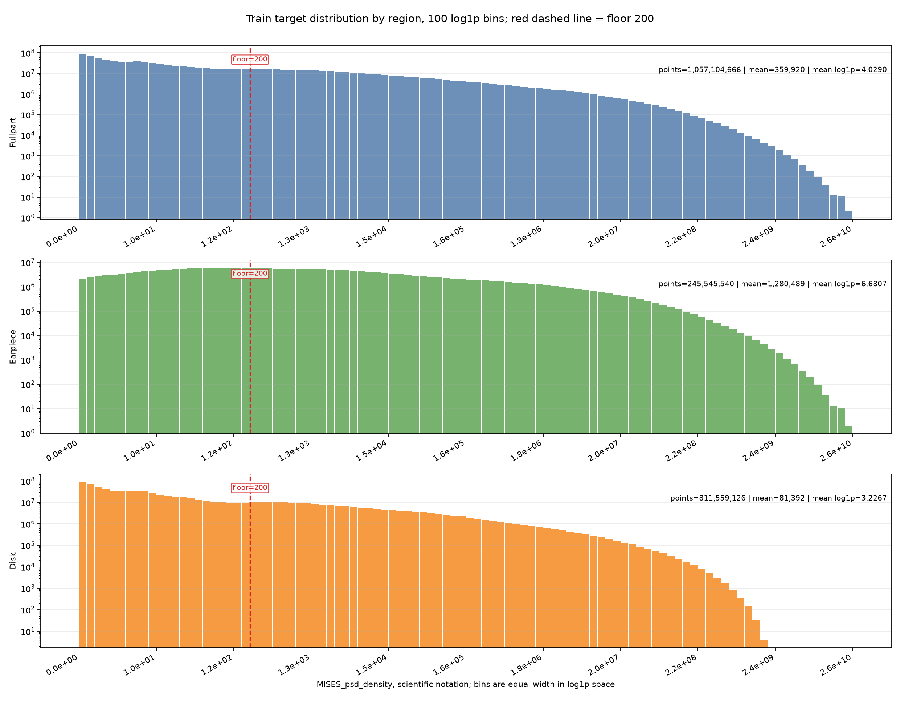
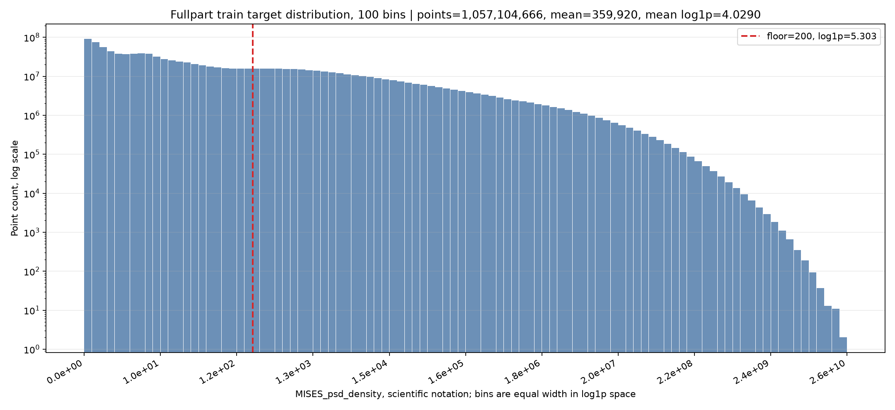
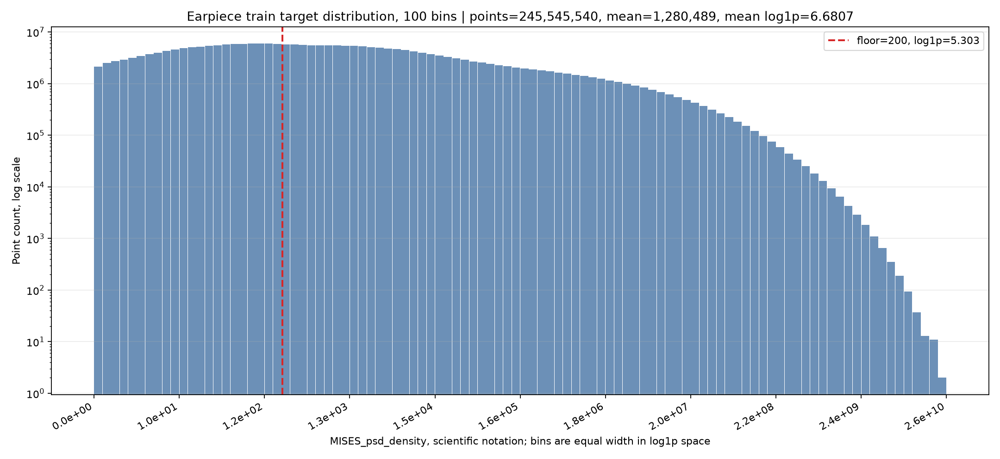
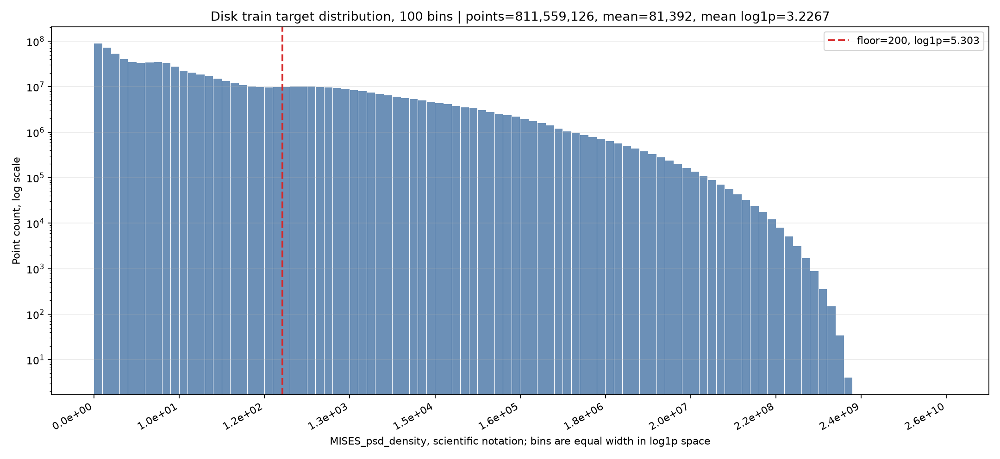
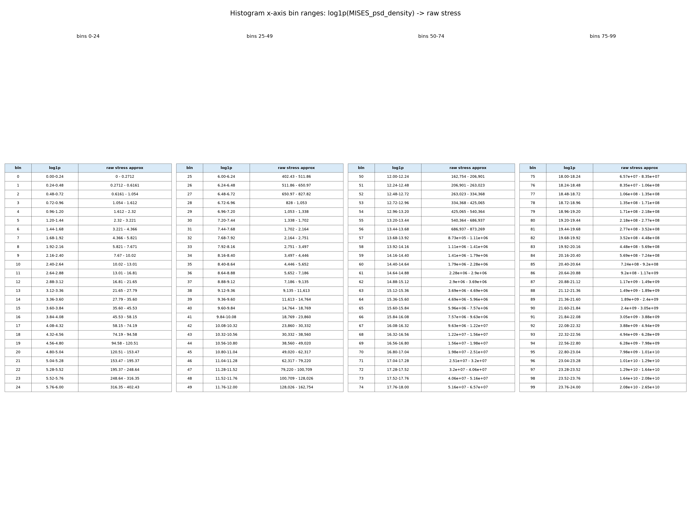

# Remove Inner Disk Floor200 模型评估报告

> 更新时间：2026-06-28 22:13 CST
> 模型：`node_mlp_v6_fullpart_fusion_low_rank_80g_fast_eval_continue32_remove_inner_disk_floor200`
> 状态：训练完成（100/100 epoch）。本报告已使用最终 best epoch 100 快照重算 test 集逐频 PSD top-percent 与 case 维度 RMises。

## 训练目的

本实验基于 `remove_inner_disk` 模型继续训练，验证一个新的数据处理假设：**圆盘和全零件中大量低响应背景点会在 `log1p`/相对误差口径下占据过多训练权重，将小于 200 的 target 统一固定为 200，可能降低背景噪声对模型的干扰，并提升整体和区域 within25。**

前置数据统计显示，训练集内 `<200` 的点占比很高，但这些点贡献的真实 target 总量极低：

| 区域 | 总点数 | `<200` 点占比 | `<200` target 总量占比 | `<200` log 贡献 |
|---|---:|---:|---:|---:|
| 全零件 | 1,057,104,666 | 68.42% | 0.0038% | 31.75% |
| 耳片区域 | 245,545,540 | 41.25% | 0.0015% | 18.92% |
| 圆盘区域 | 811,559,126 | 76.64% | 0.0149% | 39.79% |

这些低响应点不是完全无意义噪声，但它们在点数和 log loss 中占比过高。`floor200` 的目标是保留背景区域的空间分布信号，同时避免模型把大量接近 0 的目标当成主要优化对象。

## 与 remove_inner_disk 基线的主要差异

| 配置项 | remove_inner_disk | floor200 本模型 |
|---|---|---|
| init checkpoint | continue32 `best.pt` | `remove_inner_disk/best.pt` |
| `exclude_inner_disk_to_plate_hole_outer_edge` | `true` | `true` |
| `target.floor_below` | 未设置 | `200.0` |
| `target.floor_value` | 未设置 | `200.0` |
| 含义 | 保持原始 target 评估和训练 | 训练/评估中将 `<200` 的 target 统一按 200 处理 |
| selection metric | remove_inner_disk composite | floor200 composite |

> 重要口径说明：本报告的 floor200 test 指标按 floor200 配置计算，即 target `<200` 的点在评估时也按 200 参与相对误差和 log 误差。因此它能反映 floor200 策略下的当前模型效果，但不能直接等同于原始 target 口径下的最终泛化结果。

### 主要训练配置

| 配置项 | 值 |
|---|---|
| MLP hidden dims | `[256, 256, 128]` |
| low_rank_curve_head | `true`, rank=8, residual_weight=0.15 |
| activation | `silu` |
| dropout | `0.1` |
| layer norm | `true` |
| epochs | `100` |
| 当前 best epoch | `100` |
| early stopping patience | `10` |
| batch_size | `4,000,000` points |
| sample_batch_size | `384` (训练) / `16` (评估) |
| lr | `6e-5` |
| weight_decay | `1e-4` |
| target floor | `<200 -> 200` |

### 特征工程

输入共 **278 维**，与 `remove_inner_disk` 模型保持一致：

| 特征组 | 说明 |
|---|---|
| 基础几何 | 归一化坐标 (`x/y/z_norm`)、极坐标 (`r_norm`, `sin_theta`, `cos_theta`)、`dist_to_edge` |
| PSD 值 | `psd_value_at_frequency` + `log_psd_value_at_frequency` |
| 耳片局部特征 | 耳片局部坐标、距耳孔/耳轴/耳根距离、耳片连接区域标识等 |
| 圆盘中心特征 | 中心区域径向分层、RBF 核、模态区域特征 |
| 板孔特征 | 距板孔中心/边缘距离、板孔壁邻近度、板孔角度周期特征 |
| 角度周期特征 | 耳片/板孔周期角度 (`sin/cos`) |
| 应力区域距离 | 距耳孔、板孔、耳连接区等应力集中区域的距离 |
| 节点区域 mask | `is_earpiece_region`, `is_disk_region` 等区域指示 |
| 振型特征 | 前 10 阶模态振型、FRF、梯度、baseline、共振加权等 |

## 评估口径

`top1% / top2% / top5% / top10% / top15% / top25%` 按每个 case-frequency 帧内真实 target 从大到小排序后取累计比例。

主要指标：

- `within25`：相对误差 `abs(pred - target) / abs(target) <= 25%` 的点占比。
- `相对 MAE`：逐点相对误差均值。
- `相对 log MAE`：`log1p(MISES_psd_density)` 空间里的 MAE。

本次 test top-percent 评估使用训练完成后的最终 `best.pt`，对应 checkpoint epoch 100。

## 数据集规模

| 划分 | 样本数 | 总点数 | 耳片区域点数 | 圆盘区域点数 |
|---:|---:|---:|---:|---:|
| 训练集 | 82,538 | 1,057,104,666 | 245,545,540 | 811,559,126 |
| 验证集 | 10,113 | 129,825,689 | 29,184,331 | 100,641,358 |
| 测试集 | 10,607 | 135,184,771 | 31,666,289 | 103,518,482 |

> 圆盘区域不含 inner disk 到 plate hole 外边缘之间的节点，`exclude_inner_disk_to_plate_hole_outer_edge=true`。

## 训练数据分布直方图

以下直方图使用 train split 原始 target 统计，100 个 bin 在 `log1p(MISES_psd_density)` 空间等宽划分；图中 x 轴刻度显示换算后的实际 `MISES_psd_density`，使用科学计数法表示。纵轴为点数的 log scale。红色虚线为 `target=200`，即本实验 `<200 -> 200` 的 floor 阈值。

统计口径与当前模型一致：

- `node_scope: all_nodes`
- `exclude_inner_disk_to_plate_hole_outer_edge: true`
- 区域：fullpart / 耳片区域 / 圆盘区域
- target：floor 前的原始 `MISES_psd_density`









### x 轴 bin 对应的原始应力范围

直方图的 bin 是在 `log1p(MISES_psd_density)` 空间等宽划分的，每个 bin 宽度为 `0.24`。图上 x 轴显示的是按 `raw = exp(log1p) - 1` 换算后的实际 PSD 值，因此相邻刻度在原始应力空间里是非线性增大的。

完整 100-bin 范围表：

- `remove_inner_disk_floor200_数据分布直方图_20260629/x_axis_bin_stress_ranges_100bins.png`
- `remove_inner_disk_floor200_数据分布直方图_20260629/x_axis_bin_stress_ranges_100bins.csv`
- `remove_inner_disk_floor200_数据分布直方图_20260629/x_axis_bin_stress_ranges_100bins.md`



概览如下：

| bin 范围 | log1p 范围 | 原始应力范围约 |
|---:|---:|---:|
| 0-9 | 0.00 - 2.40 | 0 - 10.0232 |
| 10-19 | 2.40 - 4.80 | 10.0232 - 120.51 |
| 20-29 | 4.80 - 7.20 | 120.51 - 1,338.43 |
| 30-39 | 7.20 - 9.60 | 1,338.43 - 14,763.8 |
| 40-49 | 9.60 - 12.00 | 14,763.8 - 162,754 |
| 50-59 | 12.00 - 14.40 | 162,754 - 1.794e6 |
| 60-69 | 14.40 - 16.80 | 1.794e6 - 1.978e7 |
| 70-79 | 16.80 - 19.20 | 1.978e7 - 2.180e8 |
| 80-89 | 19.20 - 21.60 | 2.180e8 - 2.403e9 |
| 90-99 | 21.60 - 24.00 | 2.403e9 - 2.649e10 |

`target=200` 落在 **bin 22**，该 bin 的原始应力范围约为 `195.37 - 248.64`，对应 log1p 范围 `5.28 - 5.52`。

分布要点：

- fullpart 的低值主体主要由圆盘塑形，右侧高响应长尾主要来自耳片。
- 圆盘在 `target=200` 左侧的点数密度最高，是 floor200 影响最大的区域。
- 耳片整体分布比圆盘右移，但 `target=200` 左侧仍有大量点，因此全局 floor200 也会影响耳片低响应区域。

## 最终验证集指标

最终最佳 checkpoint 来自 epoch 100，selection score = **0.2156**。

| 范围 | val within25 | val 相对 MAE | val 相对 log MAE | pred / target |
|---|---:|---:|---:|---:|
| 全零件 | 84.41% | 17.90% | 0.1245 | 0.9881 |
| 耳片区域 | 67.04% | 38.16% | 0.2436 | 0.9912 |
| 圆盘区域 | 89.44% | 12.02% | 0.0900 | 0.9731 |
| 耳片 top1 | 97.32% | 4.05% | 0.0406 | 0.9219 |
| 耳片 top5 | 94.56% | 5.79% | 0.0542 | 0.9495 |

### 验证集趋势

| epoch | selection score | 全零件 within25 | 耳片区域 within25 | 耳片 top1 within25 | 耳片 top5 within25 | 圆盘 within25 |
|---:|---:|---:|---:|---:|---:|---:|
| 2 | 0.4023 | 72.23% | 49.44% | 83.34% | 82.12% | 78.85% |
| 8 | 0.2922 | 79.31% | 58.26% | 93.27% | 90.52% | 85.41% |
| 14 | 0.2687 | 80.89% | 60.72% | 94.61% | 91.96% | 86.74% |
| 20 | 0.2549 | 81.79% | 62.32% | 95.35% | 92.69% | 87.43% |
| 28 | 0.2452 | 82.44% | 63.42% | 95.91% | 93.18% | 87.96% |
| 36 | 0.2359 | 83.01% | 64.70% | 96.30% | 93.65% | 88.32% |
| 40 | 0.2355 | 83.03% | 64.60% | 96.45% | 93.68% | 88.37% |
| 50 | 0.2315 | 83.34% | 65.04% | 96.61% | 93.85% | 88.64% |
| 64 | 0.2239 | 83.80% | 66.05% | 96.99% | 94.21% | 88.95% |
| 72 | 0.2216 | 83.97% | 66.35% | 97.05% | 94.31% | 89.08% |
| 80 | 0.2189 | 84.16% | 66.66% | 97.19% | 94.42% | 89.24% |
| 90 | 0.2180 | 84.25% | 66.74% | 97.22% | 94.46% | 89.32% |
| 98 | 0.2163 | 84.34% | 66.98% | 97.31% | 94.53% | 89.38% |
| 100 | **0.2156** | **84.41%** | **67.04%** | **97.32%** | **94.56%** | **89.44%** |

## 最终评估总表

本节使用训练完成后的最终最佳 checkpoint 冻结快照：

- **checkpoint**: `final_eval_epoch100_20260628/best_epoch100_snapshot.pt`
- **best epoch**: 100
- **selection score**: 0.21560779097
- **评估 split**: test

> 口径说明：本报告沿用 floor200 配置，逐频 target `<200` 会按 200 参与 PSD 相对误差、log 误差以及 RMises 积分。因此结果反映 floor200 训练/评估口径，不能直接等同于原始 raw target 口径。

| 模型 | 评估区域 | 评估维度 | overall within25 | overall relative MAE | top1% within25 | top1% relative MAE | top5% within25 | top5% relative MAE | top10% within25 | top10% relative MAE | top15% within25 | top15% relative MAE | top25% within25 | top25% relative MAE |
|---|---|---|---:|---:|---:|---:|---:|---:|---:|---:|---:|---:|---:|---:|
| floor200 | fullpart | case-node-f 逐频 PSD 维度 | 85.38% | 17.11% | 78.15% | 16.91% | 74.36% | 19.53% | 72.67% | 20.38% | 71.67% | 21.13% | 71.25% | 22.47% |
| floor200 | fullpart | case-node 最终 RMises 维度 | 90.10% | 12.39% | 95.67% | 8.61% | 94.75% | 9.40% | 93.79% | 10.14% | 92.61% | 10.78% | 89.47% | 12.36% |
| floor200 | 耳片区域 | case-node-f 逐频 PSD 维度 | 68.28% | 37.10% | 80.84% | 15.50% | 77.34% | 17.47% | 75.23% | 19.02% | 74.30% | 19.81% | 73.06% | 20.80% |
| floor200 | 耳片区域 | case-node 最终 RMises 维度 | 81.47% | 20.15% | 95.66% | 8.74% | 95.70% | 8.69% | 95.01% | 9.06% | 94.60% | 9.28% | 94.32% | 9.65% |
| floor200 | 圆盘区域 | case-node-f 逐频 PSD 维度 | 90.61% | 10.99% | 74.08% | 17.28% | 71.83% | 18.65% | 72.94% | 18.48% | 74.68% | 17.95% | 77.36% | 17.95% |
| floor200 | 圆盘区域 | case-node 最终 RMises 维度 | 92.75% | 10.00% | 94.38% | 10.12% | 92.12% | 11.13% | 90.42% | 11.91% | 88.58% | 12.84% | 85.25% | 15.05% |

## 与 remove_inner_disk 报告对比

以下对比使用原报告的 test top-percent 结果与本次 floor200 终版 test top-percent 结果。注意两者 target 口径不同：原模型是原始 target，本模型是 `<200 -> 200` 的 floor200 target。

| 范围 | remove_inner_disk within25 | floor200 within25 | 变化 |
|---|---:|---:|---:|
| 全零件 overall | 54.19% | 85.38% | +31.19 pp |
| 耳片区域 overall | 43.26% | 68.28% | +25.02 pp |
| 圆盘区域 overall | 57.54% | 90.61% | +33.07 pp |
| 全零件 top1% | 70.80% | 78.15% | +7.35 pp |
| 全零件 top5% | 61.38% | 74.36% | +12.98 pp |
| 全零件 top25% | 48.13% | 71.25% | +23.12 pp |
| 耳片 top1% | 73.14% | 80.84% | +7.70 pp |
| 耳片 top5% | 70.01% | 77.34% | +7.33 pp |
| 耳片 top25% | 59.73% | 73.06% | +13.33 pp |
| 圆盘 top1% | 53.33% | 74.08% | +20.75 pp |
| 圆盘 top5% | 47.35% | 71.83% | +24.48 pp |
| 圆盘 top25% | 43.86% | 77.36% | +33.50 pp |

## 总结

1. **floor200 对 fullpart 和圆盘提升最明确。** 在逐频 PSD 维度，fullpart overall within25 达到 85.38%，圆盘 overall 达到 90.61%；相比 `remove_inner_disk` 基线分别提升 31.19 pp 和 33.07 pp。这与训练集统计一致：圆盘 `<200` 点占比最高，floor200 显著降低了低响应背景点对相对误差和 log loss 的干扰。

2. **耳片仍是 overall 短板，但高响应段已经明显改善。** 耳片逐频 PSD overall within25 为 68.28%，低于圆盘；但 top1% / top5% / top25% 分别达到 80.84% / 77.34% / 73.06%，说明耳片高响应区域比低/中响应背景区域更稳定。

3. **RMises 维度整体更接近工程使用口径。** fullpart、耳片、圆盘的 RMises overall within25 分别为 90.10% / 81.47% / 92.75%，均明显高于对应逐频 PSD overall。尤其耳片 RMises top1% 到 top25% 都在 94% 以上，说明最终危险节点的捕捉能力较强。

4. **圆盘 RMises overall 最稳，但 top 区间随范围扩大有下降。** 圆盘 RMises top1% 为 94.38%，top25% 为 85.25%。这说明最高响应节点拟合较好，但扩展到更宽的中高响应带后误差会增加。

5. **当前结论仍需注意 floor200 口径。** 本报告是训练完成后的 floor200 终版评估，适合判断该策略下的模型效果；如果要判断真实低响应背景区域的原始误差形态，还需要补充 raw target 口径下的对照评估。

## 附录：模型信息

- **模型路径**: `node/outputs/node_mlp_v6_fullpart_fusion_low_rank_80g_fast_eval_continue32_remove_inner_disk_floor200/best.pt`
- **配置文件**: `node/configs/node_mlp_v6_fullpart_fusion_low_rank_80g_fast_eval_continue32_remove_inner_disk_floor200.yaml`
- **resolved config**: `node/outputs/node_mlp_v6_fullpart_fusion_low_rank_80g_fast_eval_continue32_remove_inner_disk_floor200/resolved_config.yaml`
- **init checkpoint**: `node/outputs/node_mlp_v6_fullpart_fusion_low_rank_80g_fast_eval_continue32_remove_inner_disk/best.pt`
- **训练日志**: `node/outputs/node_mlp_v6_fullpart_fusion_low_rank_80g_fast_eval_continue32_remove_inner_disk_floor200/train.log`
- **训练历史**: `node/outputs/node_mlp_v6_fullpart_fusion_low_rank_80g_fast_eval_continue32_remove_inner_disk_floor200/history.csv`
- **当前指标文件**: `node/outputs/node_mlp_v6_fullpart_fusion_low_rank_80g_fast_eval_continue32_remove_inner_disk_floor200/metrics.json`
- **评估脚本**: `node/eval_top_percent_metrics.py`
- **RMises 评估脚本**:
  - `node/summarize_final_rmises_topk.py`
  - `node/evaluate_final_rmises_top_percent.py`
  - `node/evaluate_final_rmises_region_top_percent.py`
- **评估命令**:
  ```bash
  CUDA_VISIBLE_DEVICES=1 python node/eval_top_percent_metrics.py \
    --checkpoint node/outputs/node_mlp_v6_fullpart_fusion_low_rank_80g_fast_eval_continue32_remove_inner_disk_floor200/final_eval_epoch100_20260628/best_epoch100_snapshot.pt \
    --config node/outputs/node_mlp_v6_fullpart_fusion_low_rank_80g_fast_eval_continue32_remove_inner_disk_floor200/final_eval_epoch100_20260628/resolved_config_epoch100_snapshot.yaml \
    --output-dir node/outputs/node_mlp_v6_fullpart_fusion_low_rank_80g_fast_eval_continue32_remove_inner_disk_floor200/final_eval_epoch100_20260628/top_percent_eval_floor200 \
    --split test --device cuda:0 \
    --sample-batch-size 16 --num-workers 4 --progress-every 20
  ```
- **评估结果文件**:
  - `node/outputs/node_mlp_v6_fullpart_fusion_low_rank_80g_fast_eval_continue32_remove_inner_disk_floor200/final_eval_epoch100_20260628/top_percent_eval_floor200/test_top_percent_relative_metrics.json`
  - `node/outputs/node_mlp_v6_fullpart_fusion_low_rank_80g_fast_eval_continue32_remove_inner_disk_floor200/final_eval_epoch100_20260628/top_percent_eval_floor200/test_top_percent_relative_metrics.csv`
- **RMises 评估结果文件**:
  - `node/outputs/node_mlp_v6_fullpart_fusion_low_rank_80g_fast_eval_continue32_remove_inner_disk_floor200/final_eval_epoch100_20260628/final_rmises_with_per_node_test/summary.json`
  - `node/outputs/node_mlp_v6_fullpart_fusion_low_rank_80g_fast_eval_continue32_remove_inner_disk_floor200/final_eval_epoch100_20260628/final_rmises_with_per_node_test/rmises_by_case_and_quantile_plots/final_rmises_top_percent_metrics.json`
  - `node/outputs/node_mlp_v6_fullpart_fusion_low_rank_80g_fast_eval_continue32_remove_inner_disk_floor200/final_eval_epoch100_20260628/final_rmises_with_per_node_test/rmises_region_top_percent/final_rmises_region_top_percent_metrics.json`
  - `node/outputs/node_mlp_v6_fullpart_fusion_low_rank_80g_fast_eval_continue32_remove_inner_disk_floor200/final_eval_epoch100_20260628/final_rmises_with_per_node_test/rmises_region_top_percent/final_rmises_region_top_percent_metrics.csv`
